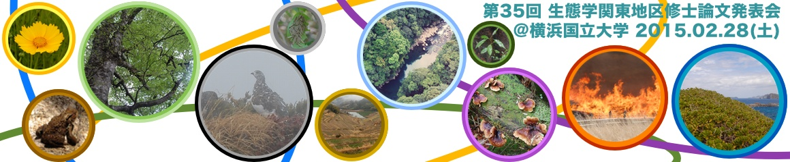



### 更新履歴

<ul class="posts">
  
    <li>{{ post.date | date_to_string }} &raquo; <a href="{{ BASE_PATH }}{{ post.url }}">{{ post.title }}</a></li>
  
</ul>

## 発表会の概要

今年度（平成26年度）の関東地区生態学関係修士論文発表会は2015年２月28日、会場を横浜国立大学に設けて開催致します。

* 場所: **横浜国立大学 環境情報１号棟 314および315室**
    * 会場までのアクセスは[こちら](access.html)をご参考ください
* 日時: **2015年２月28日（土曜日） 10:00 - 17:00**
    * 発表会の後、大学内にて懇親会を開催します
        * 懇親機会の参加費は未定です（2015年1月ごろ決定予定）

### 発表予定の修士の方へ

[参加申し込み](registration.html)についてをお読みください。
発表に関して、日本生態学会の会員である必要はありません。今年度、修士課程または博士前期課程を修了する大学院生全員に発表資格があります。

### 聴講希望の方へ

聴講のみに関しては、事前に連絡をいただく必要はありません。詳細は[参加申し込み](registration.html)をご覧ください。

## 関東地区生態学関係修士論文発表会とは

本発表会は、今年度生態学関係の修士課程を修了される大学院生のみなさまを対象に、その研究成果を発表する機会を提供するものです。また学生・研究者同士の良き交流の場となります。この発表会には、日本生態学会関東地区会の会員・非会員に関わらず参加することができます。今年も多くの方に発表をして頂きたいと考えておりますので、皆様には周囲の大学院生への周知をお願い致します。あわせて、当日のご来聴を心よりお待しております。

